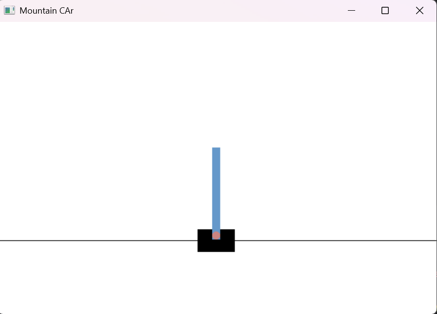
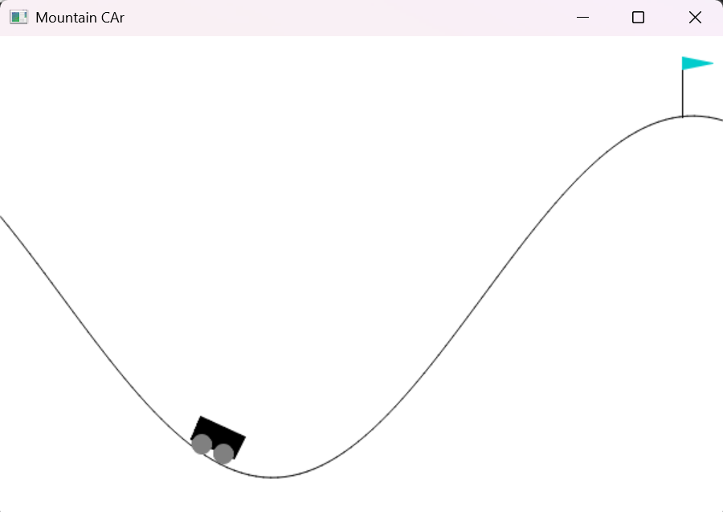

# Deep Q-Learning Implementations: CartPole and Mountain Car

This repository contains implementations of Deep Q-Learning (DQN) for two classic OpenAI Gym environments: CartPole-v1 and MountainCar-v0. Both implementations share common plotting utilities and evaluation scripts.

## Project Structure

```
.
├── dqn_cartpole.py         # CartPole DQN implementation
├── dqn_mountaincar.py      # Mountain Car DQN implementation
├── evaluatorcartpole.py    # CartPole model evaluation script
├── evaluatormountain.py    # Mountain Car model evaluation script
├── plotter.py             # Shared plotting utility for both environments
├── requirements.txt       # Project dependencies
└── README.md             # This file
```

## Environments

### CartPole-v1
The CartPole environment consists of a pole attached to a cart moving on a frictionless track. The goal is to keep the pole balanced by applying forces to the cart. The agent receives:
- State space: 4 continuous features (cart position, cart velocity, pole angle, pole angular velocity)
- Action space: 2 discrete actions (push left or right)

### MountainCar-v0
The Mountain Car environment involves a car stuck between two hills. The goal is to drive up the right hill by building momentum. The agent receives:
- State space: 2 continuous features (position and velocity)
- Action space: 3 discrete actions (push left, no push, push right)

## Implementation Details

Both implementations use:
- Deep Q-Network (DQN) with experience replay
- Target network for stable learning
- Epsilon-greedy exploration strategy
- Huber loss for robust learning
- Shared metrics tracking and visualization

Key differences:
- CartPole uses a custom reward function
- Network architectures are tailored to each environment's state space
- Hyperparameters are optimized for each environment

## Getting Started

1. Clone the repository:
```bash
git clone https://github.com/BhushanSah3/CartPole_andMountain
```

2. Install dependencies:
```bash
pip install -r requirements.txt
```

3. Train the models:
```bash
# For CartPole
python dqn_cartpole.py

# For Mountain Car
python dqn_mountaincar.py
```

4. Visualize training progress:
```bash
# For either environment
python plotter.py
```

5. Evaluate trained models:
```bash
# For CartPole
python evaluatorcartpole.py

# For Mountain Car
python evaluatormountain.py
```

## Training Visualization

The plotter.py script provides real-time visualization of training metrics:
- Total reward per episode
- Average Q-value
- Episode length
- Exploration rate (epsilon)

The same plotting utility works for both environments by changing the metric file path in plotter.py.

## Model Evaluation

The evaluator scripts load trained models and render the environment to visualize the learned policies. Each script runs 5 episodes by default.

## Dependencies

Major dependencies include:
- TensorFlow 2.x
- OpenAI Gym
- NumPy
- Pandas
- Matplotlib
- OpenCV (for visualization)

See requirements.txt for complete list.

## Environment Previews


CartPole-v1: Balance a pole on a moving cart

MountainCar-v0: Drive up the mountain using momentum

## License

This project is licensed under the MIT License - see the LICENSE file for details.

## Contributing

Feel free to open issues or submit pull requests for improvements.

## Acknowledgments

- OpenAI Gym for providing the environments
- Deep Q-Learning papers and implementations that inspired this work

